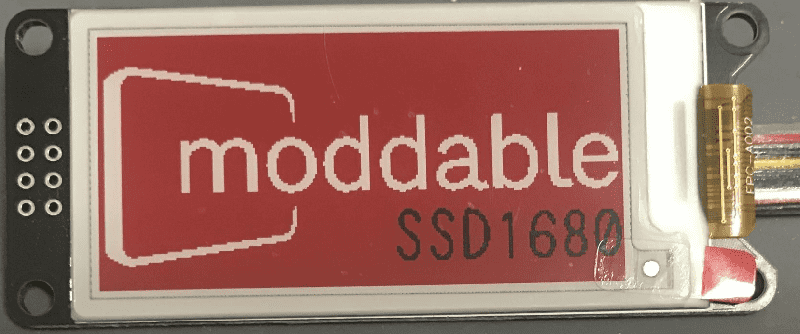
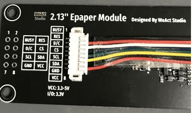
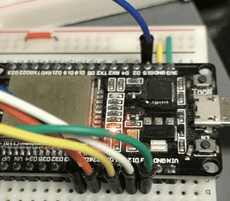

\[Example] spice/drivers/display/epd/ssd1680
================
SSD1680  
Tri-colors(Black, Red, White) E-paper display controller.

Usage
----------------

`mcconfig -d -m -p "esp32/nodemcu"`

How to generate image.dat
----------------
use `docs/image-converter.html`  
open 250x128 image  
and download image.dat  

Pin Assign
----------------

| 2.13 Epaper Module |    ESP32DevkitC    |
|--------------------|--------------------|
| Busy               | GPIO 25            |
| RST                | GPIO 26            |
| D/C                | GPIO 12            |
| CS                 | GPIO 15 (HSPI_SS)  |
| SCL                | GPIO 14 (HSPI_SCK) |
| SDA                | GPIO 13 (HSPI_MOSI)|
| GND                | GND                |
| VCC                | 3V3                |

Preview
-----------------

